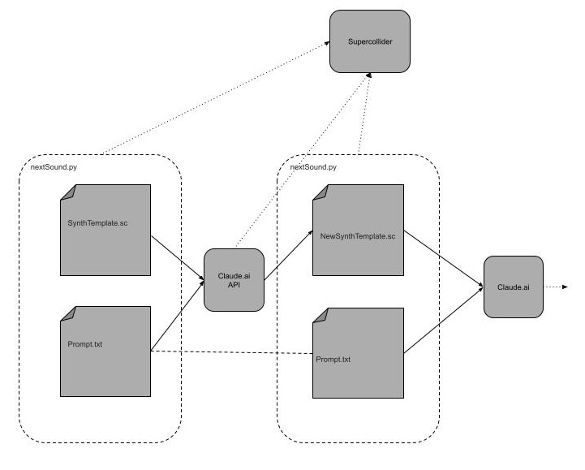

# PromptSynth
Evolving Supercollider synths using Large Language Models


### Background

- Since the launch of LLM's, I've been testing them by trying to generate [Supercollider](https://supercollider.github.io)(SC) Code. Fast forward....
[Claude](https://claude.ai) 3.5 (June 2024) was the first time succesful code was generated. Time to play!
- Began to test the depth of understanding of generating SC code
- Surprisingly successful at different prompt strategies for different outcomes... and sometimes terrible.
    - Synth construction
        - Describing a synth design with parameters
        - Model a hardware synth examples :
        [Jupiter8](https://drive.google.com/file/d/1kLJXIc4IMkB4XGaNVNmPIpQESLC0nX8_/view?usp=drive_link), 
        [MoogOne](https://drive.google.com/file/d/1nVJs2Vrq3Ig1dFBq-H3T8BDWxzX2vrT5/view?usp=drive_link), 
        [Buchla](https://drive.google.com/file/d/16biPrg_NdqQouJBjCXZD3998bJFth8Tb/view?usp=drive_link), 
        [ArpOdyssey](https://drive.google.com/file/d/1eBtU1VmAoNTex651sjrGe9ghfPwt2cEK/view?usp=drive_link)
        - Descriptive (texture, object, environment) examples :
        [Metal](https://drive.google.com/file/d/1j4aeu90Zw6Y9HyfgtfhajUw2IU8aI5lM/view?usp=drive_link), 
        [WoodBamboo](https://drive.google.com/file/d/1iGFEYUqRehFoKmd7CsPgDtE-HLmZy32E/view?usp=drive_link), 
        [Melbourne Pedestrian Crossing](https://drive.google.com/file/d/1GfH9CkV-8z7AywaxXWmyd2FNlUG4_2HH/view?usp=drive_link),
        [Raindrop](https://drive.google.com/file/d/1kNmHwaY2Vvha5fgmxy3pccB6ZsBg-B36/view?usp=drive_link), 
        [Whip Bird](https://drive.google.com/file/d/17ZW8cg7iixUhNdy2KW7bLCqi4xDrbu57/view?usp=drive_link), 
        [Forest](https://drive.google.com/file/d/1VWJ5pV1n78tGMJzQzAMb8SY5SZeR4D8T/view?usp=drive_link), 
        [Cicada](https://drive.google.com/file/d/17I0CpiqsuM6-5qYf1tVdAnvmuW4hsOGC/view?usp=drive_link), 
        [Interactive Wind](https://drive.google.com/file/d/1_eV1FP6yaCwY6lNAucM3GAFHEq2MOhNm/view?usp=drive_link)

    - Music construction examples :
    [Steve Reich](https://drive.google.com/file/d/1j7j1DL9zCZSC6ChSmomMlB9nWo4k9mR_/view?usp=drive_link), 
    [Brain Eno](https://drive.google.com/file/d/1ZQELwrDCwq7ojRjepIz-G9rywpmMj2Q3/view?usp=drive_link), 
    [Stockhausen](https://drive.google.com/file/d/1nMHKK7Q6OLKrMDuJSDCDYjV6wdrAz8Ui/view?usp=drive_link), 
    [Xenakis](https://drive.google.com/file/d/1PdD9RArZNr_spna-E1SLZ-lGmBbOOYPX/view?usp=drive_link), 
    [Deadmua5](https://drive.google.com/file/d/1ScaG9HOQbfqu-v3rlusgCy_XCH1-jQ0h/view?usp=drive_link)

- Synth construction WINS! 
- Vibe coding (ish) ([Andrej Karpathy](https://karpathy.ai)) : continue to use this in all my synth designs, from building scaffolding code to abstract descriptions.
- 2025 : The need to automate : [Claude’s API](https://docs.anthropic.com/en/release-notes/api). $ign me up!


### Present :

- Dependencies : Claude.ai API / Supercollider / Python

- Steps :
    - Create Virtual Environment
    - Install Python Requirements
    - set ```export ANTHROPIC_API_KEY=```
    - Set a prototype synth ```template_0.sc```
    - Set prompt (used for every iteration) ```prompt.sc```
    - Run ```oscCommands.sc``` in SC
    - Run ```next_sound.py``` in Python

- How it works :
    - Hacked together as a very basic work flow
    - Send Claude : ```template_0.sc``` and ```prompt.sc```
    - Claude returns some code : (and calls SC to load, interpret and play new Synth Definition code)
    - Each iteration is saved and loaded into SC, so every iteration is archived.

<center></center>


- Examples (video) : links to examples of script running while Supercollider interprets and generates realtime audio. 
    - [danceCelebrate.mp4](https://drive.google.com/file/d/19qMvCt93aSonaV1_mXZQaARuYupRMwS7/view?usp=drive_link) 
    - [drumMachine.mp4](https://drive.google.com/file/d/1LWSUAB4EUDUPXSK4S94LEXkyjzLBbQSC/view?usp=drive_link)
    - [drumMachineFast.mp4](https://drive.google.com/file/d/1HmJCgiGYppnBR9q9mcRYuBWiCF3GDRz6/view?usp=drive_link)
    - [fmSynth.mp4](https://drive.google.com/file/d/1Yd1a6amb7qMy3B8TJA6aYzOH0f29R_WH/view?usp=drive_link)
    - [gentleMod.mp4](https://drive.google.com/file/d/1sN7t0zp78uStLMANbRwx0W1YERji8lde/view?usp=drive_link)
    - [leadArp.mp4](https://drive.google.com/file/d/1qNb69F4l5vE-Ec6YjzOf1fa0X5KhCvBA/view?usp=drive_link)
    - [leadArpScramble.mp4](https://drive.google.com/file/d/14zDJr-e0OEX7oe1lt7s4wA0cqIVcQQ9q/view?usp=drive_link)
    - [metalicRhythm.mp4](https://drive.google.com/file/d/1iuV9SRzf1xHYuUHiB-a-6BOzVb21k9mY/view?usp=drive_link)
    - [oceanGong.mp4](https://drive.google.com/file/d/16MWoZsP0YahS_qGImLlGn7-uizE9dFdh/view?usp=drive_link)
    - [oceanWavesErrors.mp4](https://drive.google.com/file/d/1iHyJbBUWuscQgcoa622Z5YXlsnEzJdTX/view?usp=drive_link)
    - [offHarmonics.mp4](https://drive.google.com/file/d/1qw-fbiqctG4xAbpBXOboZGdoM3jNSX1h/view?usp=drive_link)
    - [pulsingSliding.mp4](https://drive.google.com/file/d/1rFWrjhsKSlXn0ITyOeY-dpGwYsQ3-Q1l/view?usp=drive_link)
    - [richPad.mp4](https://drive.google.com/file/d/1u3vp4QFLhzIT6ktJPWeoFWUbggUerDuU/view?usp=drive_link)


- Outcome so far : 
    - Very successful in creating a family of sounds that evolve over each iteration
    - Errors propagate but sometimes disappear after several iterations
    - Feels like growing synths
    - Have not improved or developed the idea further as I am too busy ‘prompting’ new ideas and listening. Is this a good thing?

### Future : 

- Rag (Retrieval-Augmented Generation), MCP (Model Context Protocol) and general tooling.
- Build more robust ‘play ground’ for testing LLM’s, workflows and prompting strategies.
- Archive outputs : code, audio, error, analysis.
- Automate automate automate : batch process all of it.
- Local model version.
- Looking for collaborators :  ideas, techniques, code
- Big dream : local model running on a RPI that generates continuous soundscape with prompting (text for now) that guides the composition.
    
